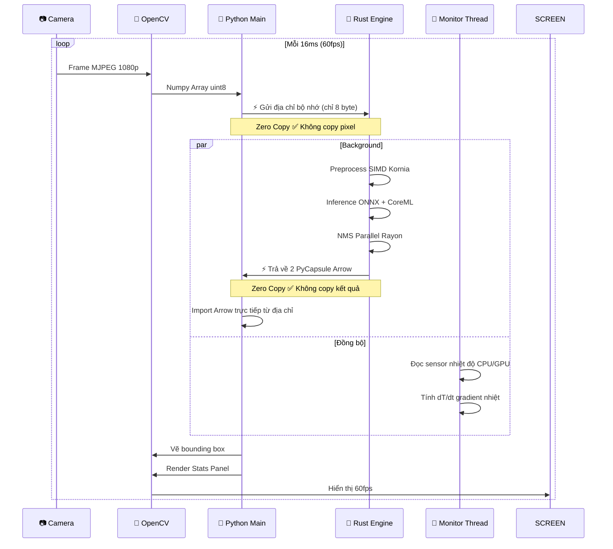
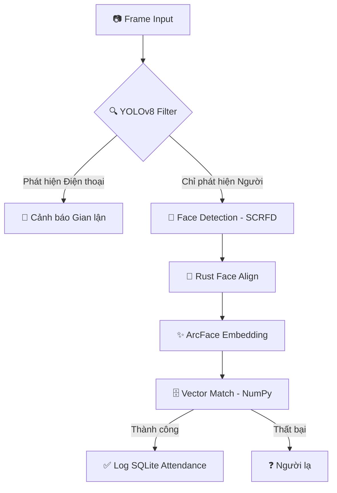

# Rust YOLO & Face ID Attendance System — Edge AI Engine

Tối ưu mô hình YOLO hiệu suất cao và hệ thống điểm danh Face ID đa nền tảng với kiến trúc lai **Rust + Python**. Dự án hỗ trợ tăng tốc phần cứng tối đa thông qua **CoreML** (Apple Silicon) và **WebGPU** (Windows, Linux, Mac), kết hợp với cơ chế truyền dữ liệu **Zero-copy** giúp đạt hiệu năng tốt nhất.

---

## 🚀 Đặc điểm kỹ thuật

| Đặc tính | Giá trị                                                         |
|---|-----------------------------------------------------------------|
| Kiến trúc | Hybrid Rust + Python (Hiệu năng Rust + Linh hoạt Python)        |
| Inference Engine | ONNX Runtime + CoreML / WebGPU (Vulkan, DX, Metal)              |
| Face ID | SCRFD (Detection) + ArcFace (Embedding) + SQLite                |
| Data Transfer | Apache Arrow C Data Interface **Zero Copy**                     |
| Đa luồng | Rayon data parallelism (NMS & Preprocess)                       |
| Thermal Control | Adaptive Thermal Scheduling (Tự động điều tiết FPS)             |
| Latency yolov8n | ~8.84ms (CoreML), ~10.05ms (WebGPU), ~21.48ms (CPU) trên M4 Pro |

---

## 📂 Cấu trúc dự án

```
RustYolo/
├── src/                    # Core Engine (Rust Native)
├── apps/                   # Application Layer (Python)
├── benchmark/              # Benchmark Tool (Multi-engine)
├── attendance_system/      # Face ID Solution
├── main.py                 # Entry point YOLO Detection
├── Cargo.toml              # Rust configuration
└── requirements.txt        # Python dependencies
```

---

### 📐 1. Luồng xử lý Engine YOLO (Core Engine)

Đây là luồng xử lý cơ bản cho việc phát hiện vật thể, tối ưu cho tốc độ và truyền dữ liệu không sao chép (Zero-copy).



* **Python**: chỉ chịu trách nhiệm I/O và UI
* **Rust**: toàn bộ tính toán nặng, AI, xử lý số liệu
* **Không có copy dữ liệu** qua biên giới ngôn ngữ
* GIL được release 100% trong quá trình inference

---

### 🛡️ 2. Luồng bảo mật Face ID (Attendance Workflow)

Tích hợp thêm bộ lọc an toàn (Safety Filter) để chống giả mạo trước khi tiến hành nhận diện khuôn mặt.



* **YOLO Filter**: Lớp bảo vệ đầu tiên, chỉ cho phép nhận diện khi có người thực và không có thiết bị điện tử.
* **Batch Processing**: Rust Engine xử lý căn chỉnh khuôn mặt đồng thời để tối ưu hiệu năng.
* **Vector Search**: So khớp 512-dim embedding cực nhanh bằng thư viện NumPy.

---

## 🆔 Hệ thống điểm danh Face ID (Attendance System)

Điểm danh thông minh tích hợp sẵn trong thư mục `attendance_system/` với các tính năng bảo mật cao:

* **Chống giả mạo (Anti-Spoofing)**: Sử dụng YOLOv8x để phát hiện thiết bị điện tử (điện thoại, máy tính bảng) trong khung hình, ngăn chặn việc dùng ảnh/video để điểm danh giả.
* **Đăng ký 8 góc độ**: Quy trình đăng ký nhân viên thu thập khuôn mặt từ 8 hướng khác nhau (ngước, cúi, trái, phải...) để đảm bảo AI nhận diện chính xác nhất.
* **Zero-copy Inference**: Toàn bộ dữ liệu ảnh được truyền thẳng vào Rust Engine thông qua Apache Arrow, đảm bảo độ trễ cực thấp ngay cả khi xử lý nhiều khuôn mặt cùng lúc.
* **Quản lý SQLite**: Lưu trữ thông tin nhân viên và log điểm danh nội bộ, dễ dàng tích hợp với các hệ thống quản trị nhân sự hiện có.

---

## 🛠️ Cài đặt và triển khai

### 1. Yêu cầu hệ thống

* **Hệ điều hành**:

  * **macOS**: 13.0+ (Khuyến nghị Apple Silicon ARM64).
  * **Windows**: Windows 10/11 (64-bit).
  * **Linux**: Ubuntu 22.04 LTS trở lên.

* **Môi trường lập trình**:

  * **Python**: 3.12+ (Hỗ trợ tốt nhất cho Windows DLL loading).
  * **Rust**: 1.94+ (Edition 2024).

### 2. Cài đặt dependencies

1. Tạo môi trường ảo (Python venv)

    ```bash
    python -m venv .venv
    ```

2. Kích hoạt môi trường ảo

    ```bash
    # Cho macOS / Linux:
    source .venv/bin/activate
   
    # Cho Windows:
    .venv\Scripts\activate
    ```

3. Cài đặt các thư viện Python

    ```bash
    # Cài đặt với PIP
    pip install -r requirements.txt
    ```

4. Cài đặt Rust (Biên dịch Engine)

* Truy cập https://rust-lang.org/learn/get-started/


### 3. Biên dịch Native Extension (Chọn 1 trong 3 kiểu build)

Dự án hỗ trợ 3 kiểu build tối ưu cho từng nền tảng phần cứng khác nhau:

```bash
# Tối ưu cho Mac (M1/M2/M3/M4/M5)
maturin develop --release

# Đa nền tảng (Vulkan/Metal/DirectX) qua WebGPU
maturin develop --release --features webgpu
```

### 4. Tải mô hình Yolo và chuyển đổi thành ONNX

```bash
python export_onnx_for_rust.py # yolov8n
```

### 5. Chạy các ứng dụng Demo

Dự án cung cấp nhiều demo khác nhau tùy theo mục đích sử dụng:

* **Demo Phát hiện vật thể (YOLOv8):**

    ```bash
    python main.py --model yolov8n.onnx --ep coreml
    ```

*   **Demo Điểm danh Face ID (Đơn giản):**

    ```bash
    python attendance_system/demo.py
    ```

*   **Ứng dụng Điểm danh bảo mật (Có Anti-Spoofing):**

    ```bash
    python attendance_system/check_in.py
    ```

*   **Đăng ký nhân viên mới:**

    ```bash
    python attendance_system/register_user.py
    ```

---

### 6. Sử dụng Camera từ Network Stream

Ứng dụng hỗ trợ kết nối camera từ xa qua các giao thức stream:

```bash
# RTSP Stream:
python main.py --model yolov8n.onnx --camera "rtsp://192.168.x.x:8888/stream"

# TTP Stream
python main.py --model yolov8n.onnx --camera "http://192.168.x.x:8888/video"

# TCP Stream (FFmpeg)
python main.py --model yolov8n.onnx --camera "tcp://192.168.x.x:8888"

# Camera local (mặc định)
python main.py --model yolov8n.onnx
```

> **Lưu ý:**
> - Đối với stream URL, ứng dụng sẽ không áp dụng các cấu hình độ phân giải và FPS (phụ thuộc vào server stream).
> - Đảm bảo server stream đang chạy và port mở trước khi kết nối.
> - OpenCV cần được build với FFMPEG support để xử lý các protocol mạng.

---

## ⚡ Performance Benchmark (Apple Silicon)

**Kiến trúc không block UI**: Luôn chạy camera 60fps mượt mà 100% bất kể tốc độ model. Video không bao giờ bị đứng hay giật lag. Chỉ có bounding box cập nhật theo tốc độ inference AI.

### 1. Apple CoreML (Tối ưu nhất cho Mac)

| Model | TOTAL LATENCY | ENGINE FPS | CAMERA FPS | Trải nghiệm |
|---|---------------|------------|---|---|
| yolov8n | ~8.84 ms      | ~113.1 fps | 60 fps | Cực kỳ mượt |
| yolov8s | ~13.37 ms     | ~74.8 fps  | 60 fps | Cực kỳ mượt |
| yolov8m | ~20.21 ms     | ~49.5 fps  | 60 fps | Rất mượt |
| yolov8l | ~28.93 ms     | ~34.6 fps  | 60 fps | Mượt |
| yolov8x | ~38.51 ms     | ~26.0 fps  | 60 fps | Mượt |

### 2. WebGPU (Đa nền tảng / GPU chung)

| Model | TOTAL LATENCY | ENGINE FPS | CAMERA FPS | Trải nghiệm |
|---|---------------|------------|---|---|
| yolov8n | ~10.05 ms     | ~99.5 fps  | 60 fps | Cực kỳ mượt |
| yolov8s | ~20.56 ms     | ~48.6 fps  | 60 fps | Rất mượt |
| yolov8m | ~46.21 ms     | ~21.6 fps  | 60 fps | Ổn định |
| yolov8l | ~84.29 ms     | ~11.9 fps  | 60 fps | Thấp |
| yolov8x | ~127.88 ms    | ~7.8 fps   | 60 fps | Rất chậm |

### 3. CPU thuần (Không tăng tốc GPU)

| Model | TOTAL LATENCY | ENGINE FPS | CAMERA FPS | Trải nghiệm |
|---|---------------|------------|---|---|
| yolov8n | ~21.48 ms     | ~46.5 fps  | 60 fps | Mượt |
| yolov8s | ~33.32 ms     | ~30.0 fps  | 60 fps | Thấp |
| yolov8m | ~65.63 ms     | ~15.2 fps  | 60 fps | Rất chậm |
| yolov8l | ~124.95 ms    | ~8.0 fps   | 60 fps | Lag |
| yolov8x | ~173.40 ms    | ~5.8 fps   | 60 fps | Rất lag |

> **Tổng kết**: 
> * **CoreML** là lựa chọn số 1 trên macOS, mang lại tốc độ và hiệu suất năng lượng tốt nhất.
> * **WebGPU** là giải pháp cân bằng, hiệu năng cực tốt cho các model nhẹ và có khả năng tương thích cao.
> * **CPU** chỉ nên dùng cho mục đích kiểm thử hoặc trên các hệ thống không có GPU hỗ trợ.

### 📊 Biểu đồ so sánh hiệu năng

<p align="center">
  
  <br/>
  <em>Hình 1: Biểu đồ so sánh Total Latency (ms) giữa các model YOLOv8 (n/s/m/l/x) với CoreML, WebGPU và CPU</em>
</p>

<p align="center">
  
  <br/>
  <em>Hình 2: Biểu đồ so sánh Engine FPS giữa các model YOLOv8 (n/s/m/l/x) với CoreML, WebGPU và CPU</em>
</p>

### 🔬 Chạy Benchmark

Công cụ benchmark tự động đo lường latency qua cả 3 engine (CPU, CoreML, WebGPU) với 100 ảnh COCO thực tế:

```bash
# Chạy benchmark đầy đủ
python benchmark/run_benchmark.py

# Benchmark vòng lặp liên tục (phát hiện thermal throttle)
python benchmark/run_benchmark.py --loop

# Custom models
python benchmark/run_benchmark.py --models yolov8n.onnx yolov8s.onnx

# Vẽ biểu đồ sau khi benchmark
python benchmark/generate_plots.py
```

> Benchmark sử dụng `benchmark_mode=True` để bỏ qua `to_pylist()` (O(N) copy Python), đo chính xác thời gian inference Rust thuần.

---

## 📜 Credits

Module `src/face` được phát triển dựa trên mã nguồn gốc từ dự án [face_id-rs](https://github.com/RuurdBijlsma/face_id-rs) của [RuurdBijlsma](https://github.com/RuurdBijlsma).

---

## 📝 License

[MIT License](LICENSE). Sử dụng hoàn toàn miễn phí cho mục đích thương mại và phi thương mại.
