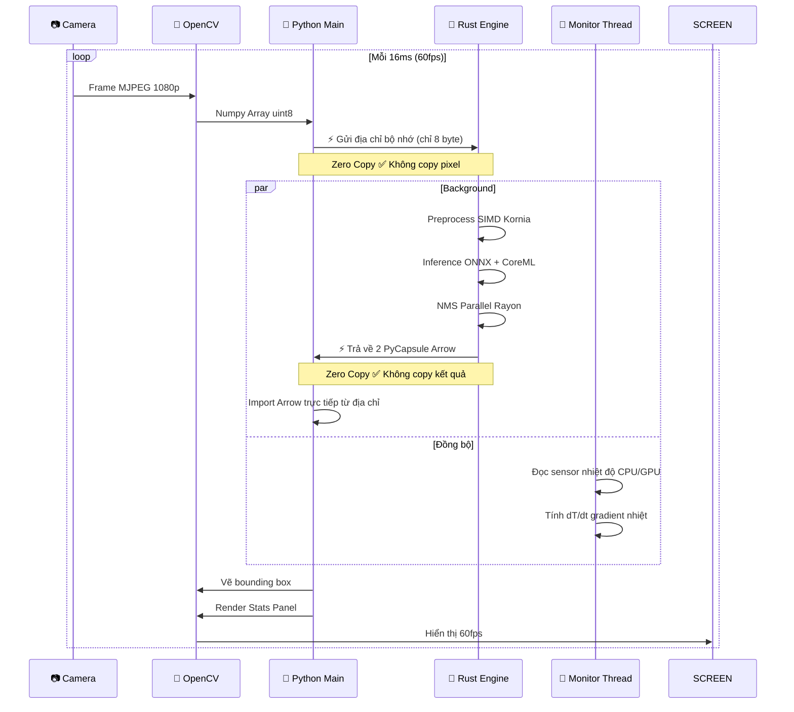
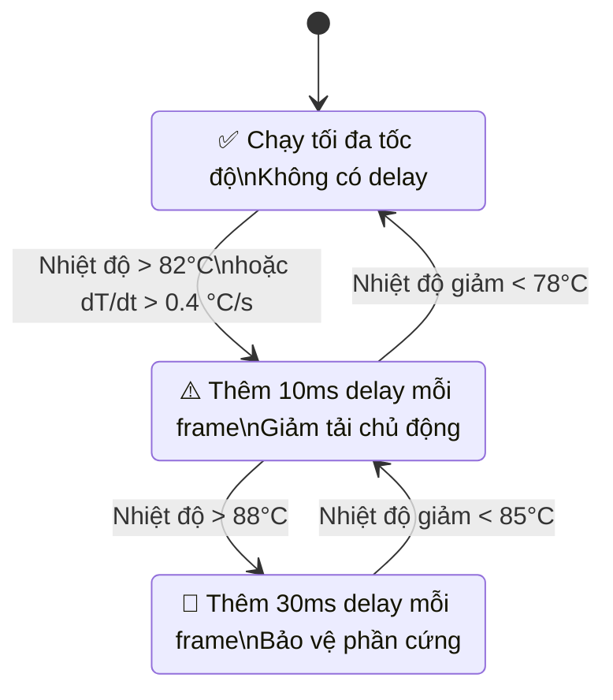

# Rust YOLO Edge AI

Tối ưu mô hình YOLO hiệu suất cao cho Apple Silicon với kiến trúc lai Rust + Python.

---

## 🚀 Đặc điểm kỹ thuật

| Đặc tính | Giá trị                                     |
|---|---------------------------------------------|
| Kiến trúc | Hybrid Rust + Python                        |
| Inference Engine | ONNX Runtime + CoreML Hardware Acceleration |
| Data Transfer | Apache Arrow C Data Interface **Zero Copy** |
| Đa luồng | Rayon data parallelism                      |
| Xử lý ảnh | Kornia CPU optimized                        |
| Monitoring | Native macOS system telemetry               |
| Latency yolov8n | ~23.5ms / frame (M4 Pro)                    |
| Latency yolov8x | ~60.5ms / frame (M4 Pro)                    |

---

## 📂 Cấu trúc dự án

```
rust_yolo/
├── src/                    # Rust native extension
│   ├── lib.rs              # PyO3 module binding
│   ├── yolo.rs             # YOLOv8 inference + NMS engine
│   ├── monitor.rs          # System performance monitor
│   ├── ffi.rs              # Apache Arrow C Data bridge
│   └── image_proc.rs       # Kornia preprocessing pipeline
├── apps/                   # Python application layer
│   ├── detector.py         # Python wrapper + annotation
│   ├── performance_monitor.py
│   ├── ui_panel.py         # OpenCV stats UI render
│   └── config.py
├── main.py                 # Entry point camera demo
├── Cargo.toml
└── requirements.txt
```

---

### 📐 Luồng xử lý từng frame



* **Python**: chỉ chịu trách nhiệm I/O và UI
* **Rust**: toàn bộ tính toán nặng, AI, xử lý số liệu
* **Không có copy dữ liệu** qua biên giới ngôn ngữ
* GIL được release 100% trong quá trình inference

---

## 🌡️ Cơ chế Thermal Aware Scheduling

Đây là tính năng cốt lõi của đề tài nghiên cứu:



---

## 🛠️ Cài đặt và triển khai

### 1. Yêu cầu hệ thống
- macOS 13.0+ (Apple Silicon ARM64)
- Python 3.12+
- Rust 1.94+

### 2. Cài đặt dependencies
```bash
# Python
python -m venv .venv
source .venv/bin/activate
pip install -r requirements.txt

# Rust
curl --proto '=https' --tlsv1.2 -sSf https://sh.rustup.rs | sh
```

### 3. Biên dịch Native Extension (Chọn 1 trong 3 kiểu build)

Dự án hỗ trợ 3 kiểu build tối ưu cho từng nền tảng phần cứng khác nhau:

*   **Tối ưu cho Mac (M1/M2/M3/M4/M5)**
    ```bash
    maturin develop --release
    ```

*   **Đa nền tảng (Vulkan/Metal/DirectX) qua WebGPU**
    ```bash
    maturin develop --release --features webgpu
    ```

### 4. Tải mô hình Yolo và chuyển đổi thành ONNX
```bash
python export_onnx_for_rust.py # yolov8n
```

### 5. Chạy demo

Sau khi build thành công kiểu nào, bạn cần chạy với tham số `--ep` (Execution Provider) tương ứng:

*   **Chạy với CoreML (MacOS):**
    ```bash
    python main.py --model yolov8n.onnx --ep coreml
    ```

*   **Chạy với WebGPU (GPU đa nền tảng):**
    ```bash
    python main.py --model yolov8n.onnx --ep webgpu
    ```

*   **Chạy thuần CPU (Dùng cho máy không có GPU):**
    ```bash
    python main.py --model yolov8n.onnx --ep cpu
    ```

---

## ⚡ Performance Benchmark (Apple Silicon)

**Kiến trúc không block UI**: Luôn chạy camera 60fps mượt mà 100% bất kể tốc độ model. Video không bao giờ bị đứng hay giật lag. Chỉ có bounding box cập nhật theo tốc độ inference AI.

| Model | AI Latency | AI FPS | Camera Display FPS | Trải nghiệm người dùng |
|---|---|--------|---|-------------------|
| yolov8n | 23.5 ms | 40 fps | 60 fps | Mượt nhất         |
| yolov8s | 28.5 ms | 35 fps | 60 fps | Mượt              |
| yolov8m | 38.5 ms | 26 fps | 60 fps | Ổn định      |
| yolov8l | 48.5 ms | 21 fps | 60 fps | Hơi chậm              |
| yolov8x | 60.5 ms | 16 fps | 60 fps | Chậm              |

---

## 🔧 Tính năng

* Realtime object detection 80 classes COCO
* Full system monitoring: CPU, GPU, Memory, Thermal
* Thermal gradient dT/dt realtime measurement
* Full latency breakdown per stage
* Hardware accelerated CoreML ANE / GPU
* Zero copy data transfer
* Thread safe background monitoring
* Hỗ trợ toàn bộ dòng YOLOv8
* Adaptive Thermal Scheduling tự động điều tiết tải
* Non-blocking UI luôn mượt 60fps

---

## 📝 License

[MIT License](LICENSE). Sử dụng hoàn toàn miễn phí cho mục đích thương mại và phi thương mại.
