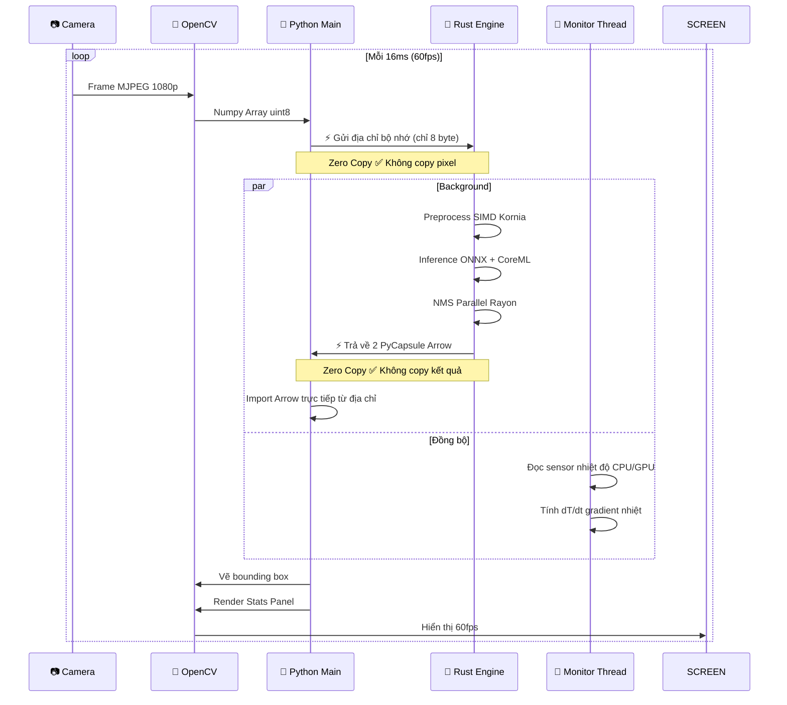
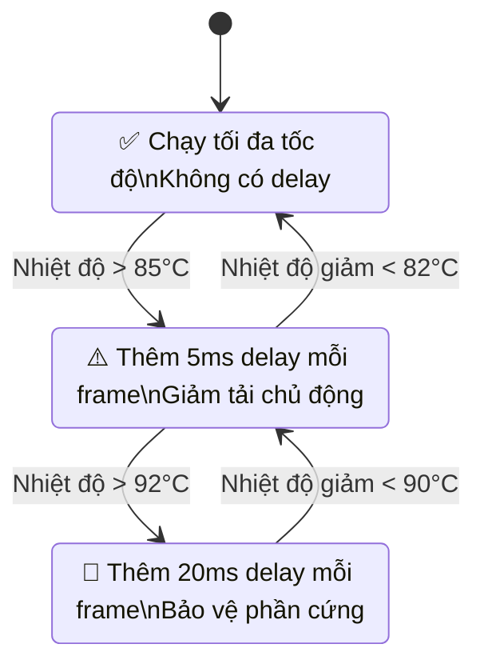
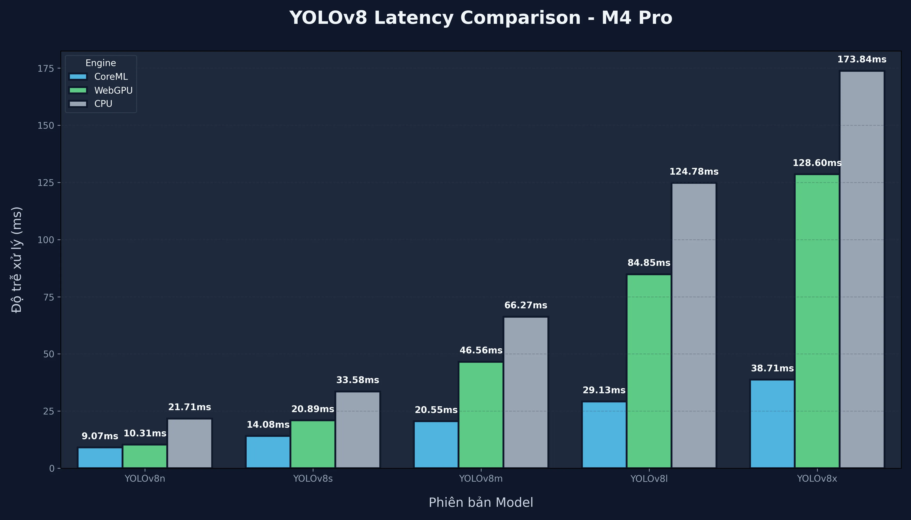
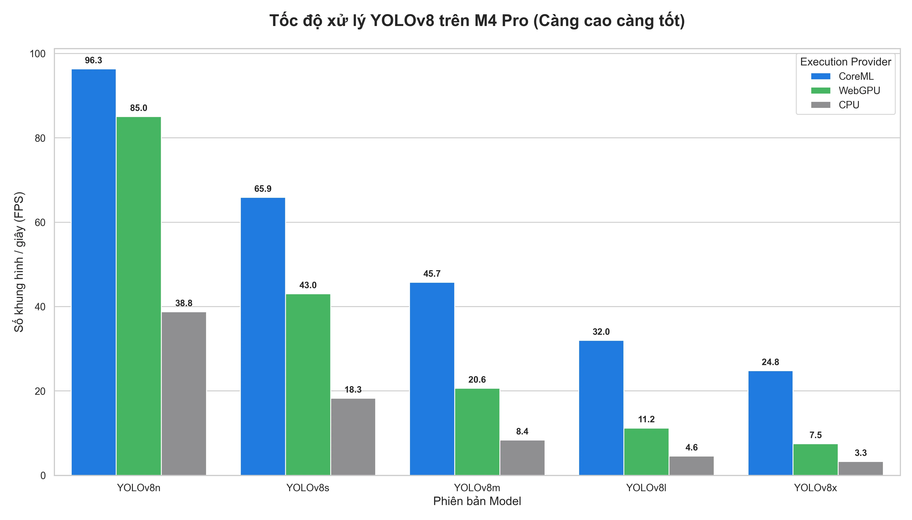

# Rust YOLO Edge AI — High-Performance Inference Engine

Tối ưu mô hình YOLO hiệu suất cao, đa nền tảng với kiến trúc lai **Rust + Python**. Dự án hỗ trợ tối đa tăng tốc phần cứng thông qua **CoreML** (cho Apple Silicon) và chính thức hỗ trợ **WebGPU** cho Windows, Linux và Mac.

---

## 🚀 Đặc điểm kỹ thuật

| Đặc tính | Giá trị                                               |
|---|-------------------------------------------------------|
| Kiến trúc | Hybrid Rust + Python (Phối hợp hiệu năng & linh hoạt) |
| Inference Engine | ONNX Runtime + CoreML / WebGPU (Vulkan, DX, Metal)    |
| Data Transfer | Apache Arrow C Data Interface **Zero Copy**           |
| Đa luồng | Rayon data parallelism (NMS & Preprocess)             |
| Xử lý ảnh | Kornia CPU optimized (SIMD acceleration)              |
| Monitoring | Native System Telemetry (CPU, GPU, Thermal)           |
| Latency yolov8n | ~13ms (CoreML), ~13ms (WebGPU) trên M4 Pro            |

---

## 📂 Cấu trúc dự án

```
rust_yolo/
├── src/                    # Rust native extension
│   ├── lib.rs              # PyO3 module binding
│   ├── yolo.rs             # YOLOv8 inference + NMS engine
│   ├── monitor.rs          # System performance monitor
│   ├── ffi.rs              # Apache Arrow C Data bridge
│   └── image_proc.rs       # Kornia preprocessing pipeline
├── apps/                   # Python application layer
│   ├── detector.py         # Python wrapper + annotation
│   ├── performance_monitor.py
│   ├── ui_panel.py         # OpenCV stats UI render
│   └── config.py
├── main.py                 # Entry point camera demo
├── Cargo.toml
└── requirements.txt
```

---

### 📐 Luồng xử lý từng frame



* **Python**: chỉ chịu trách nhiệm I/O và UI
* **Rust**: toàn bộ tính toán nặng, AI, xử lý số liệu
* **Không có copy dữ liệu** qua biên giới ngôn ngữ
* GIL được release 100% trong quá trình inference

---

## 🌡️ Cơ chế Thermal Aware Scheduling

Đây là tính năng cốt lõi của đề tài nghiên cứu:



---

## 🛠️ Cài đặt và triển khai

### 1. Yêu cầu hệ thống

*   **Hệ điều hành**:

    *   **macOS**: 13.0+ (Khuyến nghị Apple Silicon ARM64).
    *   **Windows**: Windows 10/11 (64-bit).
    *   **Linux**: Ubuntu 22.04 LTS trở lên.

*   **Môi trường lập trình**:

    *   **Python**: 3.12+ (Hỗ trợ tốt nhất cho Windows DLL loading).
    *   **Rust**: 1.94+ (Edition 2024).

### 2. Cài đặt dependencies

1. Tạo môi trường ảo (Python venv)

    ```bash
    python -m venv .venv
    ```

2. Kích hoạt môi trường ảo

    ```bash
    # Cho macOS / Linux:
    source .venv/bin/activate
   
    # Cho Windows:
    .venv\Scripts\activate
    ```

3. Cài đặt các thư viện Python

    ```bash
    # Cài đặt với PIP
    pip install -e .
    
    # Cài đặt với UV (Khuyên dùng)
    uv sync
    ```

4. Cài đặt Rust (Biên dịch Engine)

* Truy cập https://rust-lang.org/learn/get-started/


### 3. Biên dịch Native Extension (Chọn 1 trong 3 kiểu build)

Dự án hỗ trợ 3 kiểu build tối ưu cho từng nền tảng phần cứng khác nhau:

*   **Tối ưu cho Mac (M1/M2/M3/M4/M5)**
    ```bash
    maturin develop --release
    ```

*   **Đa nền tảng (Vulkan/Metal/DirectX) qua WebGPU**
    ```bash
    maturin develop --release --features webgpu
    ```

### 4. Tải mô hình Yolo và chuyển đổi thành ONNX
```bash
python export_onnx_for_rust.py # yolov8n
```

### 5. Chạy demo

Sau khi build thành công kiểu nào, bạn cần chạy với tham số `--ep` (Execution Provider) tương ứng:

*   **Chạy với CoreML (MacOS):**
    ```bash
    python main.py --model yolov8n.onnx --ep coreml
    ```

*   **Chạy với WebGPU (GPU đa nền tảng):**
    ```bash
    python main.py --model yolov8n.onnx --ep webgpu
    ```

*   **Chạy thuần CPU (Dùng cho máy không có GPU):**
    ```bash
    python main.py --model yolov8n.onnx --ep cpu
    ```

---

## ⚡ Performance Benchmark (Apple Silicon)

**Kiến trúc không block UI**: Luôn chạy camera 60fps mượt mà 100% bất kể tốc độ model. Video không bao giờ bị đứng hay giật lag. Chỉ có bounding box cập nhật theo tốc độ inference AI.

### 1. Apple CoreML (Tối ưu nhất cho Mac)

| Model | TOTAL LATAENCY | ENGINE FPS | CAMERA FPS | Trải nghiệm |
|---|---|---|---|---|
| yolov8n | ~12.9 ms | ~77.9 fps | 60 fps | Cực kỳ mượt |
| yolov8s | ~19.4 ms | ~50.6 fps | 60 fps | Rất mượt |
| yolov8m | ~26.5 ms | ~36.5 fps | 60 fps | Mượt |
| yolov8l | ~37.0 ms | ~27.4 fps | 60 fps | Ổn định |
| yolov8x | ~48.1 ms | ~21.6 fps | 60 fps | Ổn định |

### 2. WebGPU (Đa nền tảng / GPU chung)

| Model | TOTAL LATENCY | ENGINE FPS | CAMERA FPS | Trải nghiệm |
|---|---|---|---|---|
| yolov8n | ~12.8 ms   | ~78.1 fps | 60 fps | Cực kỳ mượt |
| yolov8s | ~19.8 ms   | ~42.8 fps | 60 fps | Rất mượt |
| yolov8m | ~49.1 ms   | ~20.3 fps | 60 fps | Ổn định |
| yolov8l | ~87.2 ms   | ~11.5 fps | 60 fps | Thấp |
| yolov8x | ~131.2 ms  | ~7.6 fps | 60 fps | Rất chậm |

### 3. CPU thuần (Không tăng tốc GPU)

| Model | TOTAL LATAENCY | ENGINE FPS | CAMERA FPS | Trải nghiệm |
|---|---|---|---|---|
| yolov8n | ~33.4 ms | ~30.0 fps | 60 fps | Mượt |
| yolov8s | ~68.6 ms | ~14.6 fps | 60 fps | Thấp |
| yolov8m | ~139.5 ms | ~7.2 fps | 60 fps | Rất chậm |
| yolov8l | ~263.2 ms | ~3.8 fps | 60 fps | Lag |
| yolov8x | ~364.4 ms | ~2.7 fps | 60 fps | Rất lag |

> **Tổng kết**: 
> * **CoreML** là lựa chọn số 1 trên macOS, mang lại tốc độ và hiệu suất năng lượng tốt nhất.
> * **WebGPU** là giải pháp cân bằng, hiệu năng cực tốt cho các model nhẹ và có khả năng tương thích cao.
> * **CPU** chỉ nên dùng cho mục đích kiểm thử hoặc trên các hệ thống không có GPU hỗ trợ.

### 📊 Biểu đồ so sánh hiệu năng (Python High-Quality)

<p align="center">
  
  <br/>
  <em>Hình 1: Biểu đồ so sánh Total Latency (ms) giữa các model YOLOv8 (n/s/m/l/x) với CoreML, WebGPU và CPU</em>
</p>

<p align="center">
  
  <br/>
  <em>Hình 2: Biểu đồ so sánh Engine FPS giữa các model YOLOv8 (n/s/m/l/x) với CoreML, WebGPU và CPU</em>
</p>

---

## 🔧 Tính năng

* Realtime object detection 80 classes COCO
* Full system monitoring: CPU, GPU, Memory, Thermal
* Thermal gradient dT/dt realtime measurement
* Full latency breakdown per stage
* Hardware accelerated CoreML (Apple Neural Engine / GPU)
* Native WebGPU support (Vulkan, Metal, DirectX 12)
* Zero copy data transfer (Apache Arrow)
* Thread safe background monitoring
* Hỗ trợ toàn bộ dòng YOLO như v8, v11, v26
* Adaptive Thermal Scheduling tự động điều tiết tải
* Non-blocking UI luôn mượt 60fps
* Tự động tối ưu hóa giao diện cho màn hình Retina/High-DPI (macOS)

---

## 📝 License

[MIT License](LICENSE). Sử dụng hoàn toàn miễn phí cho mục đích thương mại và phi thương mại.
